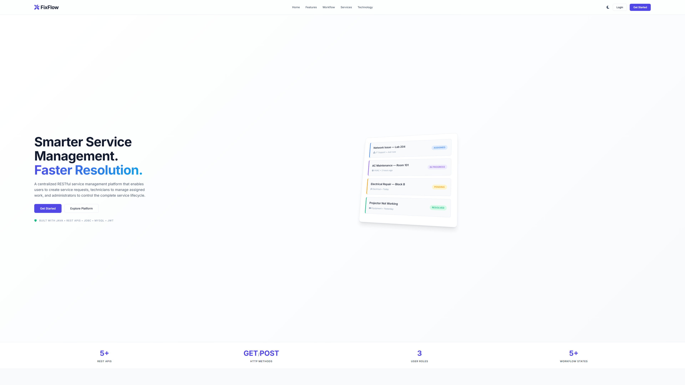
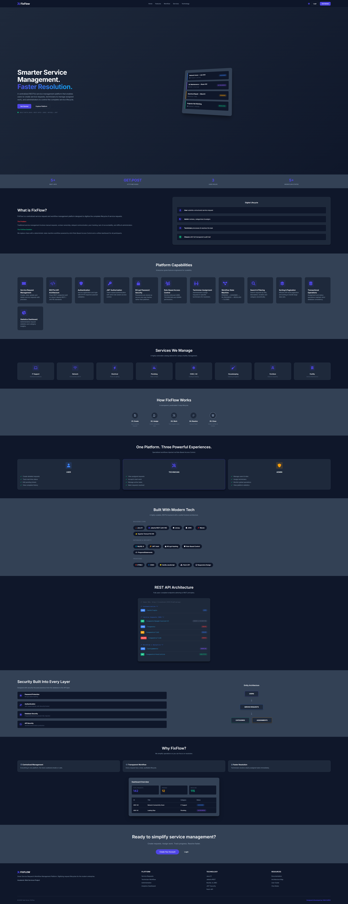
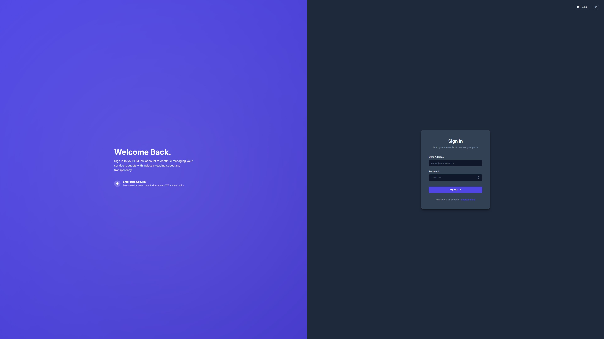
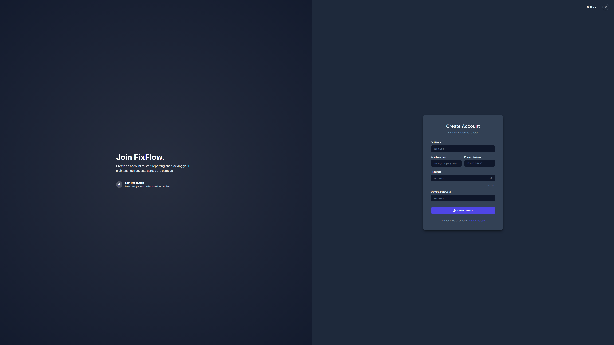
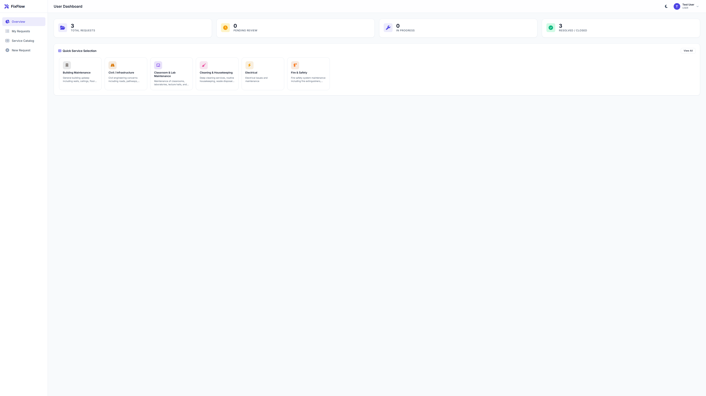
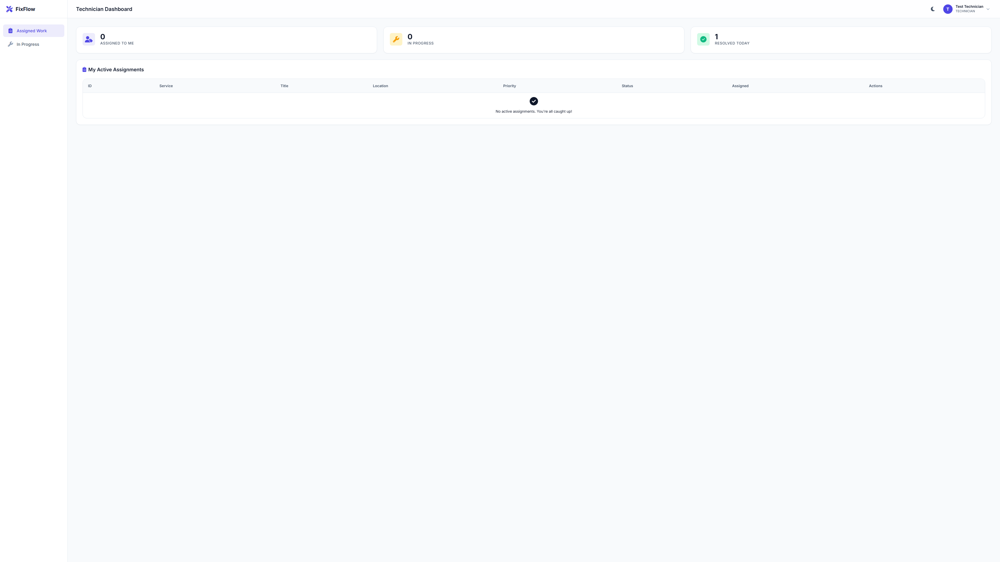
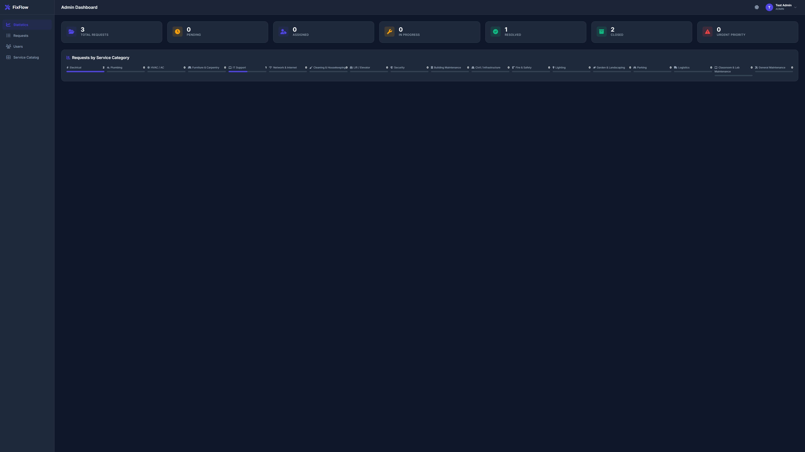
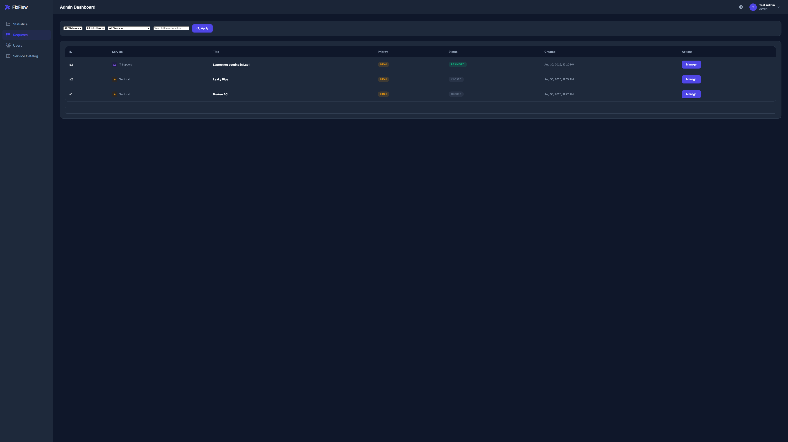
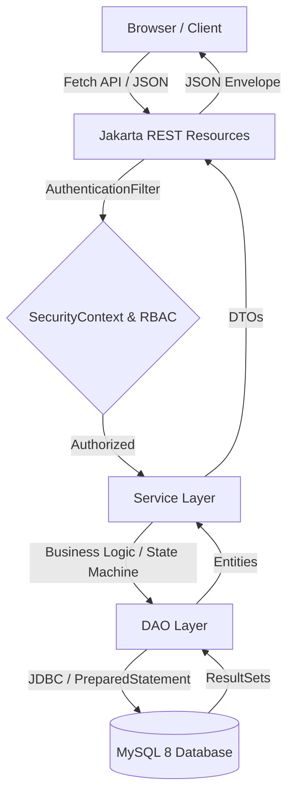

<div align="center">
  
</div>

# FixFlow — Enterprise Service Management Platform

A highly scalable, secure, and centralized service request and workflow management platform engineered for modern organizations.


<p align="center">
  <b>Project Status:</b> 🟢 Active / Production-Ready &nbsp;•&nbsp; <b>Version:</b> 1.0.0 &nbsp;•&nbsp; <b>License:</b> MIT
</p>

---

## 📖 Project Overview

Large organizations, university campuses, and corporate facilities constantly receive maintenance and service issues ranging from IT and network failures to electrical and plumbing emergencies. 

Traditional service management relies on scattered emails, phone calls, or paper requests, resulting in:
- Unclear task ownership and delayed communication.
- Poor tracking and zero accountability.
- Inability to analyze recurring issues or measure technician efficiency.

**FixFlow** solves this chaos by digitizing the entire service lifecycle into a deterministic state-machine workflow. Powered by strict Role-Based Access Control (RBAC), a robust REST API, and a centralized dashboard, FixFlow ensures every request is categorized, prioritized, assigned, and tracked transparently from creation to resolution.

---

## ✨ Key Features

### 🔐 Authentication & Security
- **User Registration & Login**: Secure credential management.
- **JWT Authentication**: Stateless token-based identity verification.
- **BCrypt Password Hashing**: Passwords are mathematically hashed, never stored in plaintext.
- **Role-Based Authorization (RBAC)**: Strict separation of privileges between `USER`, `TECHNICIAN`, and `ADMIN`.
- **Protected REST Endpoints**: Granular control via custom `@Secured` annotations and `SecurityContext`.

### 📝 Service Requests
- **Complete CRUD Lifecycle**: Create, view, update, partially patch, and delete requests.
- **Priority Management**: Set LOW, NORMAL, HIGH, or URGENT priorities.
- **Category Management**: Organized by departments (e.g., IT, Electrical, Plumbing).
- **Location Tracking**: Precise physical location strings attached to requests.

### 🧑‍🔧 Technician Workflow
A transparent, non-bypassable workflow state machine:
`PENDING` ➔ `ASSIGNED` ➔ `IN_PROGRESS` ➔ `RESOLVED` ➔ `CLOSED`
*(Requests can also be `CANCELLED` by authorized users before assignment).*

### 🛡️ Administration
- **User Management**: Admins can promote/demote users and manage accounts.
- **Technician Assignment**: Admins act as dispatchers, mapping pending requests to specialized technicians.
- **Category Control**: Dynamic expansion of service categories.
- **Analytics Dashboard**: Real-time statistical aggregation of system health and request volumes.

### 🌐 Advanced REST Features
- Complete HTTP verb support (`GET`, `POST`, `PUT`, `PATCH`, `DELETE`).
- **Pagination**: Offset/limit based pagination to handle massive datasets gracefully.
- **Advanced Searching & Filtering**: Query by `status`, `priority`, `categoryId`, `location`, `fromDate`, and `toDate`.
- **Sorting**: Dynamic column sorting (`sortBy`, `sortOrder`).
- **Standardized Envelopes**: Consistent JSON response formatting featuring embedded metadata and pagination payloads.

### 💻 Frontend Architecture
- **Vanilla HTML5, CSS3, JavaScript**: Zero bloated frameworks, ensuring instant load times.
- **Fetch API Integration**: Modern asynchronous HTTP requests.
- **Responsive UI**: Mobile-first grid layouts and flexbox containers.
- **Dynamic Theming**: Seamless Dark/Light mode switching.
- **Interactive Components**: Custom Toast notifications, data tables, and dynamic modal overlays.

---

## 📸 Application Screenshots

### 🏠 The Platform

| Premium Landing Page | Dynamic Dark Theme |
|:---:|:---:|
|  |  |

### 🔐 Authentication & Access

| Secure Login | Registration |
|:---:|:---:|
|  |  |

### 🧑‍💻 Role-Based Dashboards

| User Dashboard | Technician Workflow |
|:---:|:---:|
|  |  |
| **Admin Control Center** | **Admin Assignment Dispatch** |
|  |  |

### 📝 Interactions

| Create Request (User) | Request Details / Timeline |
|:---:|:---:|
|  |  |

---

## 🏗️ Technical Architecture

FixFlow employs a strict **Layered Architecture** pattern, separating concerns into discrete, testable boundaries.



- **Resource Layer (`@Path`)**: Handles HTTP routing, request extraction, and payload validation.
- **Service Layer**: Houses the core business rules, transactional logic, and workflow state enforcement.
- **DAO (Data Access Object) Layer**: Abstracts the JDBC implementation, mapping SQL ResultSets to Java entities.
- **Security Layer**: Intercepts requests, validates JWT signatures, and injects the user's `SecurityContext`.

---

## 📂 Project Structure

```text
FixFlow/
├── src/
│   └── main/
│       ├── java/
│       │   └── com/fixflow/
│       │       ├── config/       # CORS and Application Config
│       │       ├── dao/          # Database Access Objects
│       │       ├── dto/          # Data Transfer Objects & Payloads
│       │       ├── exception/    # Custom Exceptions & Global Handlers
│       │       ├── model/        # Database Entities & Enums
│       │       ├── resource/     # JAX-RS REST Endpoints
│       │       ├── security/     # JWT AuthFilter & RBAC Annotations
│       │       ├── service/      # Business Logic
│       │       └── util/         # DB Connection & Helper Utilities
│       ├── resources/
│       │   └── database/         # SQL Schemas
│       └── webapp/
│           ├── admin/            # Admin HTML UI
│           ├── technician/       # Technician HTML UI
│           ├── user/             # User HTML UI
│           ├── css/              # Modular Stylesheets
│           ├── js/               # Frontend Logic & API Client
│           ├── META-INF/         
│           ├── index.html        # Premium Landing Page
│           ├── login.html        
│           └── register.html     
├── pom.xml                       # Maven Dependencies
├── README.md                     
├── ARCHITECTURE.md               # Deep-dive Architecture Docs
├── USER_GUIDE.md                 # End-User Manual
├── VIVA_NOTES.md                 # Academic Presentation Notes
└── .env.example                  # Environment Template
```

---

## 📡 REST API Documentation

FixFlow exposes a strict RESTful API adhering to HTTP semantics and standardized JSON responses.

### Authentication
| Method | Endpoint | Access | Purpose |
|--------|----------|--------|---------|
| `POST` | `/api/auth/register` | Public | Register a new user |
| `POST` | `/api/auth/login` | Public | Authenticate and retrieve JWT |

### Service Requests
| Method | Endpoint | Access | Purpose |
|--------|----------|--------|---------|
| `GET` | `/api/requests` | All Roles | Fetch paginated, filtered requests |
| `GET` | `/api/requests/{id}` | All Roles | Fetch a specific request by ID |
| `POST` | `/api/requests` | USER, ADMIN | Create a new request |
| `PUT` | `/api/requests/{id}` | USER, ADMIN | Full replacement of a request |
| `PATCH` | `/api/requests/{id}` | USER, ADMIN | Partial update of a request |
| `PATCH` | `/api/requests/{id}/status`| TECH, ADMIN | Update request workflow status |
| `DELETE`| `/api/requests/{id}` | ADMIN | Permanently delete a request |

### Technician Assignments
| Method | Endpoint | Access | Purpose |
|--------|----------|--------|---------|
| `GET` | `/api/assignments` | TECH, ADMIN | View task assignments |
| `GET` | `/api/assignments/{id}` | TECH, ADMIN | View specific assignment details |
| `POST` | `/api/assignments` | ADMIN | Dispatch a request to a technician |
| `PUT` | `/api/assignments/{id}` | ADMIN | Modify an assignment |
| `PATCH` | `/api/assignments/{id}` | ADMIN | Partially update assignment notes |
| `DELETE`| `/api/assignments/{id}` | ADMIN | Revoke an assignment |

### Users & Categories
| Method | Endpoint | Access | Purpose |
|--------|----------|--------|---------|
| `GET` | `/api/users` | ADMIN | List all registered users |
| `GET` | `/api/categories` | Public | List available service categories |
| `GET` | `/api/requests/statistics` | ADMIN | Aggregated system analytics |

---

## 🔄 Request Workflow State Machine

The core functionality of FixFlow is governed by a strict state progression:

1. **USER** submits a request ➔ `PENDING`
2. **ADMIN** reviews and dispatches task ➔ `ASSIGNED`
3. **TECHNICIAN** accepts and begins work ➔ `IN_PROGRESS`
4. **TECHNICIAN** completes the physical repair ➔ `RESOLVED`
5. **ADMIN** verifies and formally closes ➔ `CLOSED`

---

## 📊 Role & Permission Matrix

| Feature | USER | TECHNICIAN | ADMIN |
|---------|:---:|:---:|:---:|
| **Authentication** | ✓ | ✓ | ✓ |
| **Create Request** | ✓ | ✗ | ✓ |
| **View Own Requests** | ✓ | ✗ | ✗ |
| **View Assigned Work** | ✗ | ✓ | ✗ |
| **View All Requests** | ✗ | ✗ | ✓ |
| **Assign Technicians** | ✗ | ✗ | ✓ |
| **Update Status** | ✗ | ✓ | ✓ |
| **Manage Categories** | ✗ | ✗ | ✓ |
| **System Statistics** | ✗ | ✗ | ✓ |

---

## 🗄️ Database Architecture

A relational schema designed for strict referential integrity.

- `users`: Core identity table (PK, Email, Password Hash, Role).
- `service_categories`: Lookup table for valid departments (e.g., HVAC).
- `service_requests`: Main transactional table storing request lifecycle data (FK to Users, Categories).
- `request_assignments`: Dispatch mapping table (FK to Requests, Users/Technicians).

---

## 🛡️ Security Implementation

Security was engineered as a primary concern throughout the stack:
- **Authentication**: JWT (JSON Web Tokens) are generated upon login and verified on every protected request.
- **Password Security**: Passwords are hashed iteratively using `BCrypt`, preventing rainbow-table attacks.
- **Authorization**: Endpoints use the `@Secured({Role.ADMIN})` annotation. The custom `AuthenticationFilter` enforces access control dynamically.
- **SQL Injection Prevention**: 100% reliance on JDBC `PreparedStatement`s.
- **Data Leakage Prevention**: Sort columns and pagination parameters are validated against strict safelists.
- **Environment Isolation**: `JWT_SECRET` and `DB_PASSWORD` are pulled entirely from environment variables, keeping credentials out of source control.

---

## 🔍 Advanced Search, Filter & Pagination

The `/api/requests` endpoint supports massive query payloads.
Example query:
`GET /api/requests?page=1&limit=10&status=PENDING&priority=HIGH&sortBy=createdAt&sortOrder=DESC`

**Supported Parameters:**
- `page` & `limit`: For offset pagination.
- `status` & `priority`: Direct ENUM filtering.
- `categoryId`: Foreign key filtering.
- `search`: Performs `LIKE %query%` across titles, descriptions, and locations.
- `sortBy` / `sortOrder`: Safelisted dynamic database sorting.

---

## 📦 JSON Response Envelopes

FixFlow standardizes its communication format. Clients always know what structure to expect.

**Standard Payload:**
```json
{
  "status": "success",
  "data": { ... },
  "message": "Operation completed successfully"
}
```

**Paginated Payload:**
```json
{
  "status": "success",
  "data": [ ... ],
  "pagination": {
    "currentPage": 1,
    "pageSize": 10,
    "totalItems": 45,
    "totalPages": 5
  }
}
```

---

## 🛠️ Technology Stack

| Layer | Technology |
|-------|------------|
| **Core Language** | Java 21 |
| **REST Framework** | Jakarta RESTful Web Services (JAX-RS) / Jersey |
| **Database** | MySQL 8.0 |
| **Database Access** | Java JDBC (PreparedStatements) |
| **Authentication** | JSON Web Tokens (JJWT) |
| **Cryptography** | BCrypt |
| **Server Engine** | Apache Tomcat 10.1.50 |
| **Build System** | Apache Maven 3.9.6 |
| **Frontend UI** | HTML5, CSS3, JavaScript (Vanilla) |
| **HTTP Client** | Browser Fetch API |

---

## 🚀 Installation & Setup

These instructions apply specifically to Windows environments running NetBeans/Tomcat.

**1. Clone the Repository:**
```cmd
git clone https://github.com/YashSurve2006/FixFlow-Enterprise-Service-Management.git
cd FixFlow
```

**2. Configure Database:**
Open your MySQL client (e.g., Workbench) and run the setup script:
```sql
SOURCE src/main/resources/database/fixflow_schema.sql;
SOURCE insert_test_data.sql;
```

**3. Configure Environment Variables:**
Rename `.env.example` to `.env` or inject these via Tomcat's `setenv.bat`:
```bat
set DB_URL=jdbc:mysql://localhost:3306/fixflow_db
set DB_USER=root
set DB_PASSWORD=your_mysql_password
set JWT_SECRET=your_minimum_256_bit_secure_secret
```

**4. Build and Deploy:**
```cmd
mvn clean package
```
Copy `target/FixFlow.war` into your Tomcat `webapps/` directory and start the server.

**5. Launch:**
Open your browser and navigate to:
`http://localhost:8080/FixFlow/`

---

## ✅ Testing & Validation

The platform has undergone rigorous QA verifications:
- **Build/Deployment**: Maven packaging and Tomcat deployment (Verified).
- **Core API**: Complete CRUD matrix verification across all resources (Verified).
- **Security Check**: Role escalation prevention and JWT signature integrity (Verified).
- **Business Logic**: Enforcement of valid state transitions (Verified).
- **UX**: Dark/Light mode DOM persistence via LocalStorage (Verified).

---

## 🎬 Recommended Demo Flow (For Viva/Presentations)

For the most impactful presentation, demonstrate the application in this exact sequence:
1. **The Pitch**: Open the Landing Page, switch between Dark/Light mode, and explain the architecture.
2. **User Journey**: Login as a `USER`, create a "Leaking AC" request. Show the status is `PENDING`.
3. **Admin Dispatch**: Logout, login as an `ADMIN`. Show the statistical dashboard. Navigate to Requests, find the AC request, and assign it to a Technician.
4. **Technician Execution**: Logout, login as a `TECHNICIAN`. View assigned tasks. Update the AC request from `ASSIGNED` ➔ `IN_PROGRESS` ➔ `RESOLVED`.
5. **Closure**: Login as `ADMIN` and verify the repaired item, updating it to `CLOSED`. Demonstrate the robust search and filtering across the entire request history.

---

## 🎓 Academic Value / Key Concepts Demonstrated

This project serves as a comprehensive capstone demonstrating profound software engineering principles:
- Implementation of **RESTful Web Services** (mapping HTTP methods to logical CRUD operations).
- Deep understanding of **Stateless Authentication** (JWTs over traditional HTTP Sessions).
- **Role-Based Access Control** and Security Interceptors (`ContainerRequestFilter`).
- Protection against Injection Attacks using **Parameterized JDBC**.
- Separation of concerns through **MVC** and **Layered Architecture** paradigms.
- Managing relational data anomalies and enforcing **Foreign Key constraints**.
- Mastery of **Vanilla JavaScript Promises, async/await, and the Fetch API**.

---

## 🔗 Documentation References

For more detailed technical insights, review the supplementary documentation:
- [Architecture Deep Dive](ARCHITECTURE.md)
- [End User Guide](USER_GUIDE.md)
- [Viva Presentation Notes](VIVA_NOTES.md)

---

## 👨‍💻 Author

**Yash Surve**  
*Computer Science Student*

**FixFlow** — *Enterprise Service Management Platform*  
[https://github.com/YashSurve2006](https://github.com/YashSurve2006)
